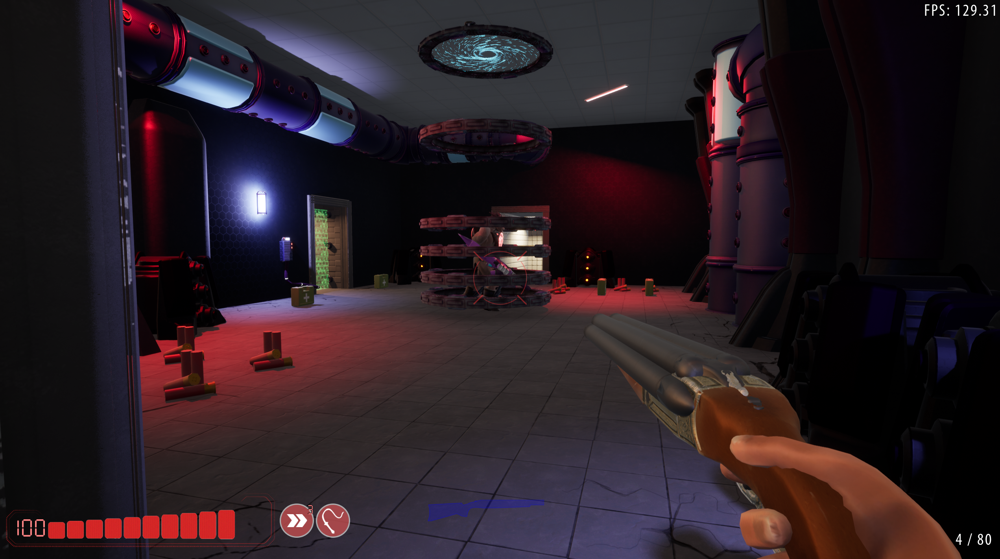

# NemesisCFx.github.io
# Cameron Fox - Game Programmer

## About Me
Hi! I'm Cameron Fox, a recent graduate with a massive passion for gameplay programming, game systems, and video games in general. I enjoy crafting player experiences - from responsive controls and interactive systems like hiding or barricading to mini-games, puzzles, and other events in between.
During my final University project, I stepped up to lead a small team of AI programmers, taking over leadership mid-project to ensure the game met deadlines and quality standards, and was rewarded with an outstanding work certificate for my efforts. I am a problem solver by nature, fascinated by
all kinds of games with a special love for single-player adventure and horror titles. My portfolio showcases both solo and collaborative projects, demonstrating my ability to implement engaging gameplay, work in teams and solo, and deliver complete, polished experiences. I am eager to bring these
skills to studios, indie teams, or QA roles.

## Education
- Joseph Wright College Derby (2 years): degree
- University of Derby (4 years): degree

## Skills
### Game Engines
- Unreal Engine
- Unity
- Pygame

### Programming Languages
- C++
- C#
- C
- Python

### Game Development Practices
- Gameplay Systems & Mechanics
- AI Systems
- Physics-Based Gameplay
- Full Game Development Lifecycle
- Debugging & Optimization

### Techincal & Professional Skills
- Version Control (Git, GitHub)
- Team Collaboration & Leadership
- Solo Development & Project Ownership
- Working to Strict Deadlines
- Game Publishing & Release Pipelines
- Continuous Learning & Skill Development

## Projects

### The Phantom Diaries: The Spectral Train
- Role: Solo Developer
- Engine: Unreal Engine 5 (C++ with Minor Blueprints Usage)
- 🎥[[Trailer]](https://www.youtube.com/watch?v=HzpkVU_9g2Y)
- ▶️ [[itch.io Game Download Page]](https://nemesiscfx.itch.io/the-phantom-diaries-the-spectral-train)
- 💻 [[GitHub Repository]](https://github.com/NemesisCFx/ThePhantomDiaries-TheSpectralTrain)

### MAU
- Role: Team then Lead (Promotion) AI Programmer
- Engine: Unreal Engine 4 (C++ with Major Blueprints Usage)
- ▶️ [[Download Link]](https://github.com/NemesisCFx/NemesisCFx.github.io/releases/download/M-v1.0/MAU.zip)
- 💻 [[GitHub Repository]](https://github.com/NemesisCFx/MAU)

### Zombie Arcade
- Role: Solo Developer
- Engine: Unity (C#)
- 🎥[[Trailer]](https://www.youtube.com/watch?v=tDdP6ZZaLQQ)
- ▶️ [[itch.io Game Download Page]](https://nemesiscfx.itch.io/zombie-arcade)
- 💻 [[GitHub Repository]](https://github.com/NemesisCFx/ZombieArcade)

### Guardians of the Forest
- Role: Solo Developer
- Engine: Unity (C#)
- 🎥[[Trailer]](https://www.youtube.com/watch?v=Mt_N8QCtcMo)
- ▶️ [[Download Link]](https://github.com/NemesisCFx/NemesisCFx.github.io/releases/download/GotF-v1.0/GuardiansOfTheForest.zip)
- 💻 [[GitHub Repository]](https://github.com/NemesisCFx/GuardiansOfTheForest)

